# Get Started
Everything you need to start developing apps for CAOS is available here. The CAOS is divided into two parts: mobile side and server side. You'll find everything from design guidelines (dependencies, configurations and setup) for the server side. Note: Preferably run the server side on Linux OS or OS X.

## Dependencies
Before any action, you must install the necessary dependencies to run on the server. Install the following programs:

* Java (JDK) (http://www.oracle.com/technetwork/pt/java/javase/downloads/index.html) (version: 1.7+)
* PostgreSQL (https://www.postgresql.org/download/) (version: 9.4)
* VirtualBox (https://www.virtualbox.org/wiki/Downloads) (version: 5.2)
* Android SDK (https://developer.android.com/studio/index.html#downloads) (version: 19+)
* Android x86 (https://sourceforge.net/projects/android-x86/files/Release%204.4/android-x86-4.4-r3.iso/download) (version: 4.4-r3)
* (Optional) Android Studio IDE (https://developer.android.com/studio/index.html) (version: -)
* (Optional – Contextual Data) MongoDB (https://www.mongodb.com/download-center) (version: 3.0)

## Initial Configurations
After installing the dependencies, configure the postgre. By default, the user and password must be “postgres“. Create a database named "caos". 

* Put the program "adb" in the system path. The "adb" should be found in the following path: 
/<installation_location>/android-sdk/platform-tools
* Put the program “virtualbox” in the system path. The “virtualbox” should be found in the following path:
/<installation_location>/virtualbox

## Installing Android on the Virtual Machine
* Create a new VM

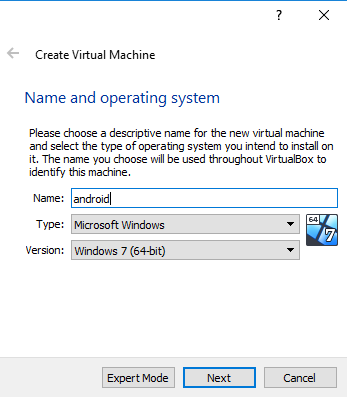

* Set at least 2GB of memory

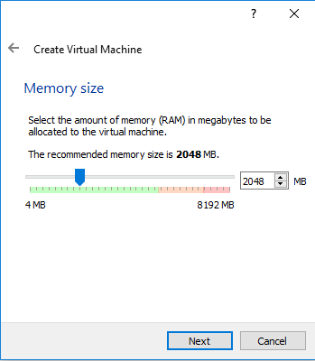

* Create a virtual hard disk

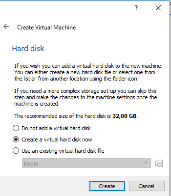

* Set the type file to VDI

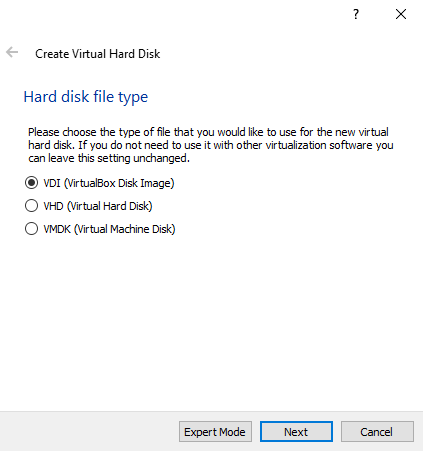

* Choose the option Dynamically allocated

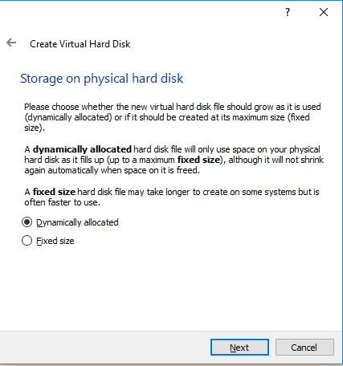

* Choose a name for the disk and set size toa t least 2GB

* Press the button Create

* Select the android image version 4.4-r3 and use it as the start-up disk

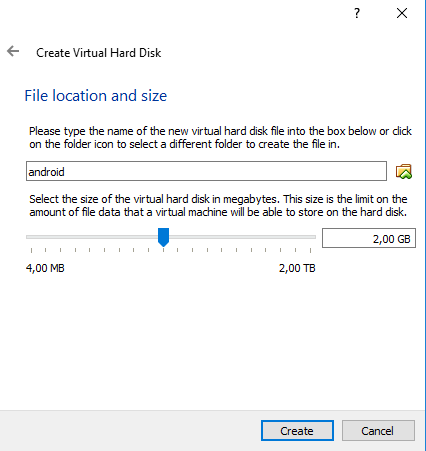

* Choose the last option

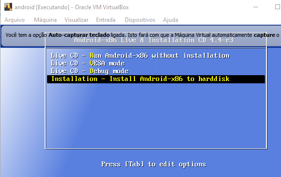

* Select SDA

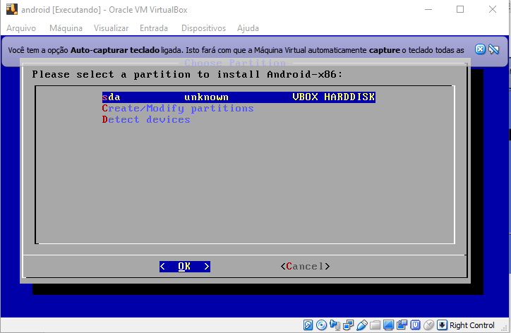

* Select Ext3

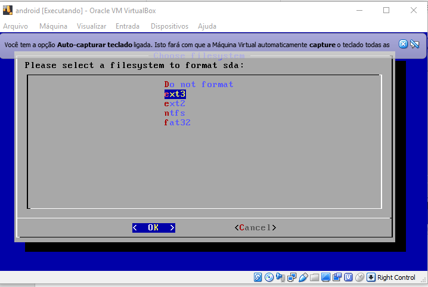

* Select Yes

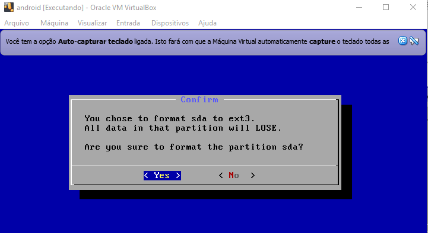

* Select Skip

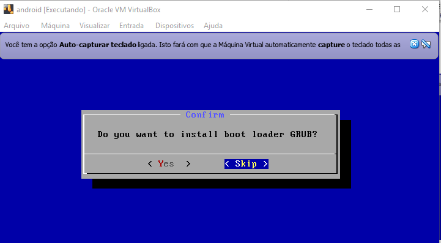

* Select Skip

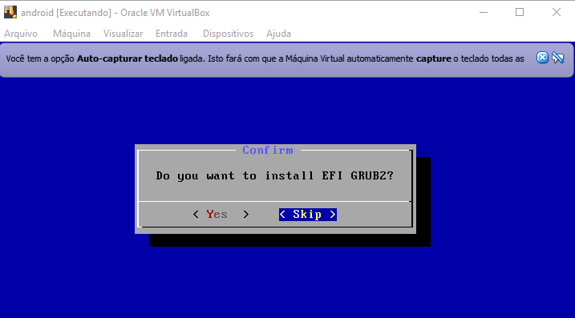

* Select Yes

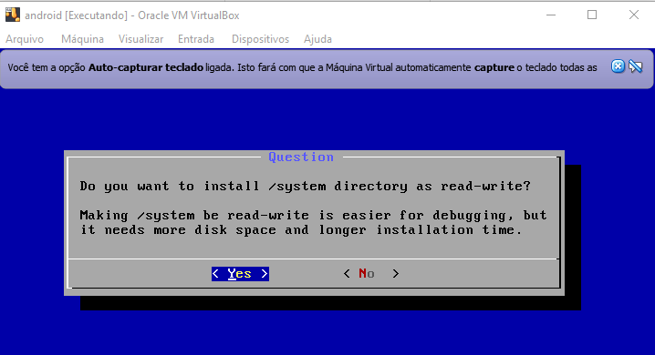

* Select Run Android x86

* Now follow a typical android initialization. Choose the language.

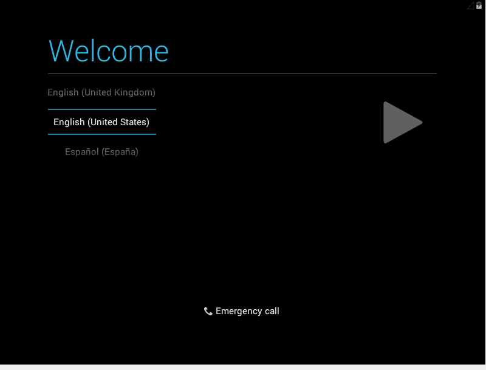

* For now skip the network configuration.

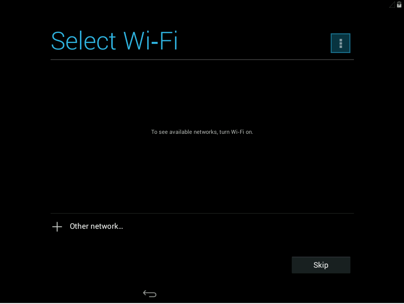

* Skip the connection with google (No)

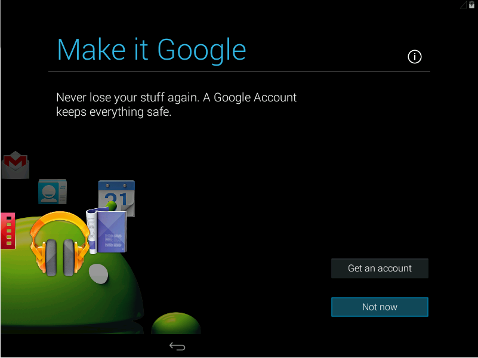

* Choose a name to your tablet.
  
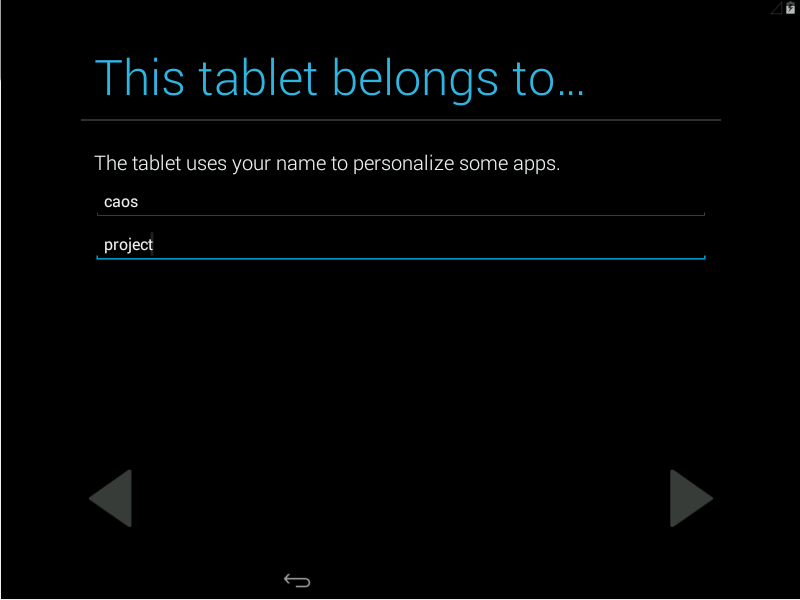

* And finish the initiallization.

**Note:** Never turn off the virtual machine. Save the machine state and close the virtualbox application.

## Configuring the Network Access on the Virtual Machine

* Select file, host network manager

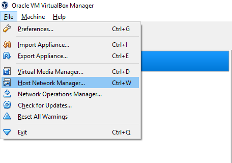

* Click on Create

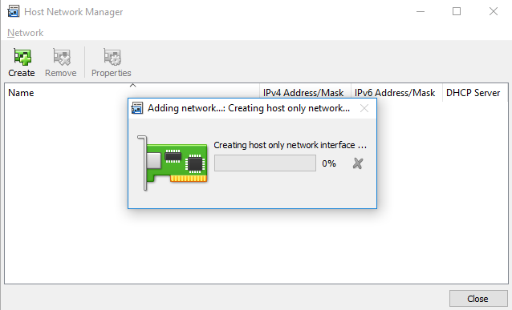

* Set the Enable DHCP server box

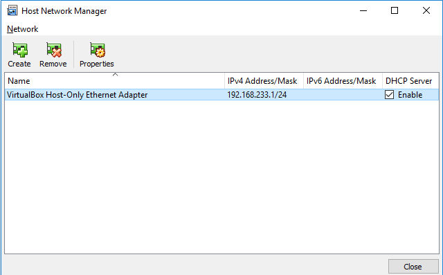

* Now click on Settings of the VM

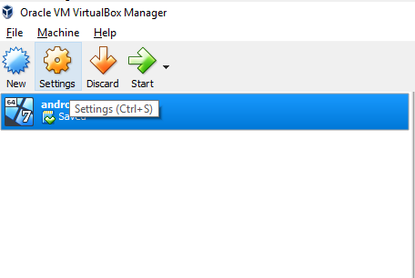

* Open the tab Network

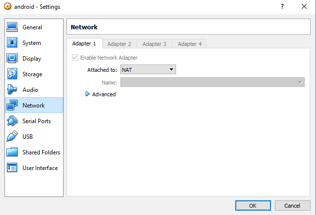

* At the field "Attached to" select Host-only Adapter and in the field "Name" select the network created previously.

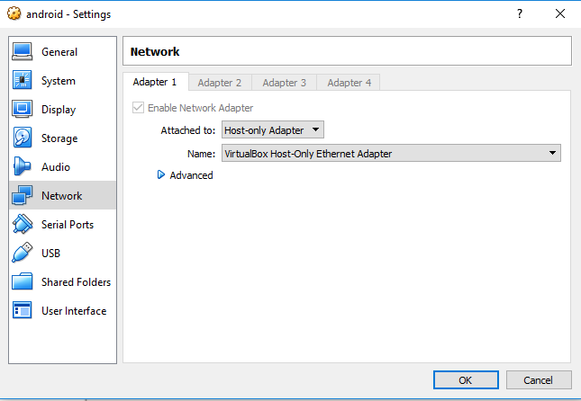

* Now, initialize the Virtual Machine

* Press Alt + F1 to open the prompt of command

* Use the command: "netcfg" to find the IP. The IP will be the interface eth0 (192.168.233.3). The IP will be used in configuration of vms in the CAOS Controller.

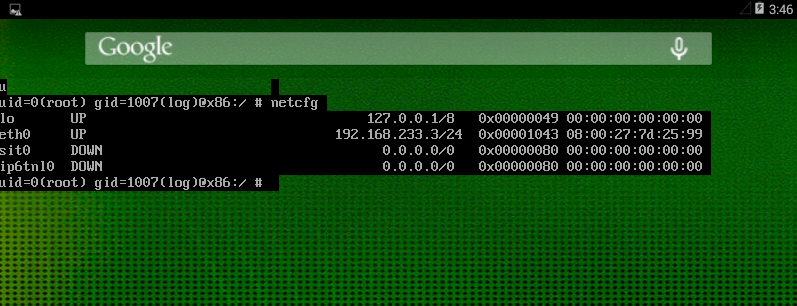

Done all these steps, it is now possible to start developing a CAOS-based application. Click here to learn how to create the "Hello World" application. Click [here](Processing.md).
